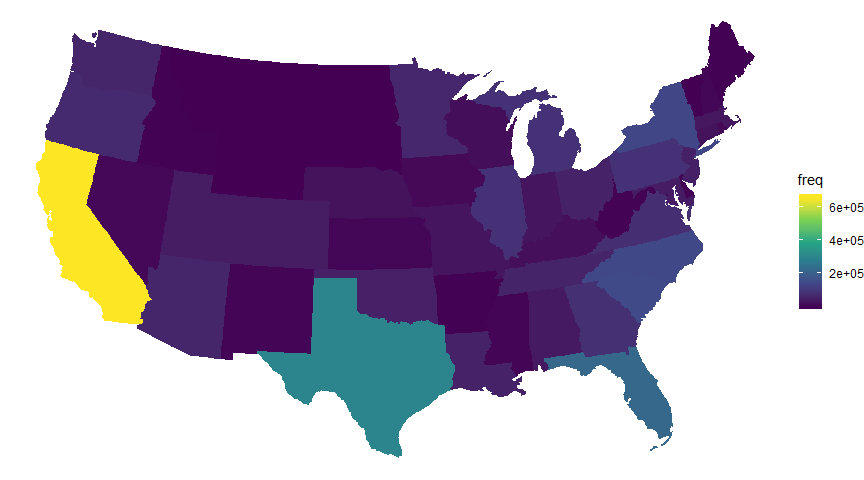
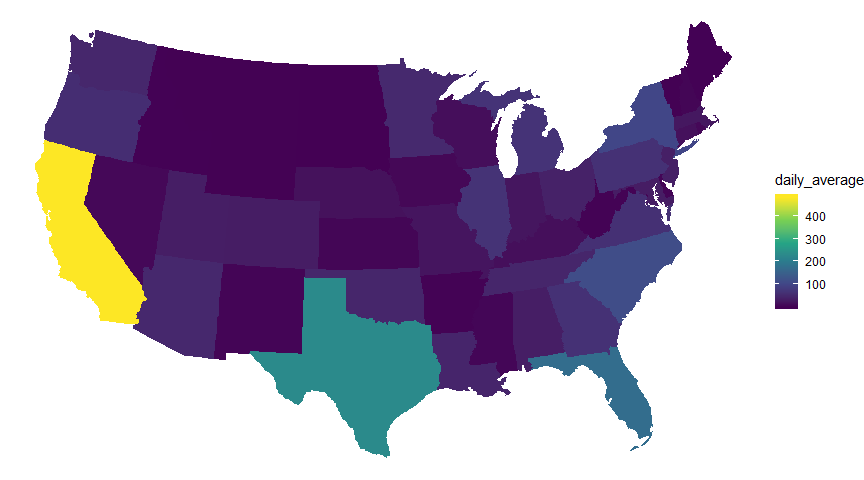
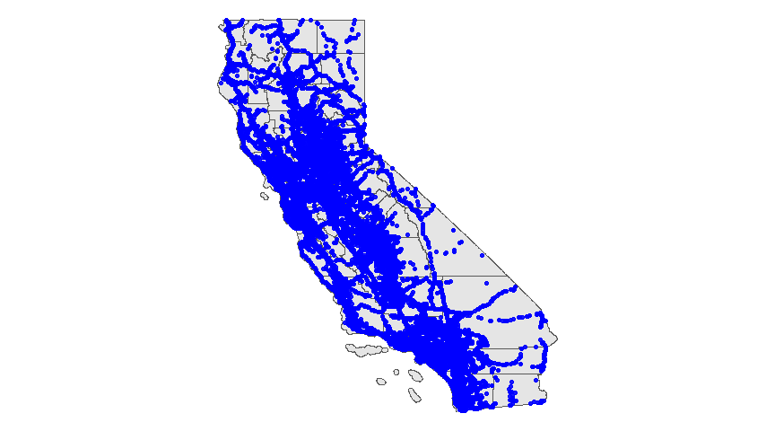
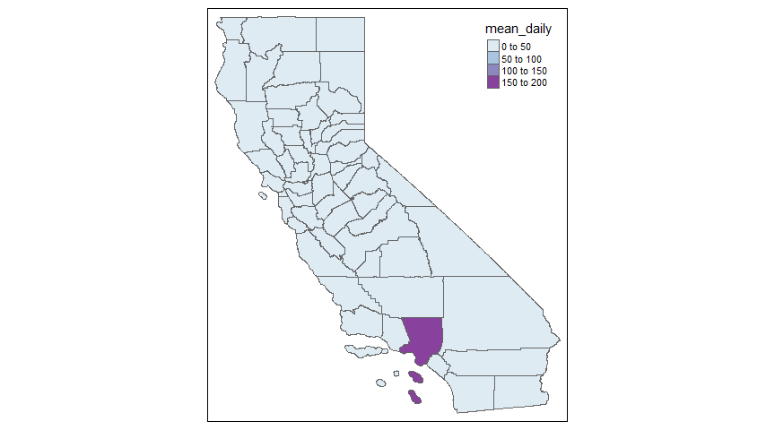
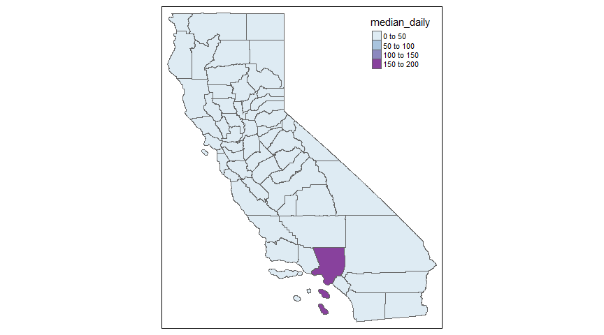
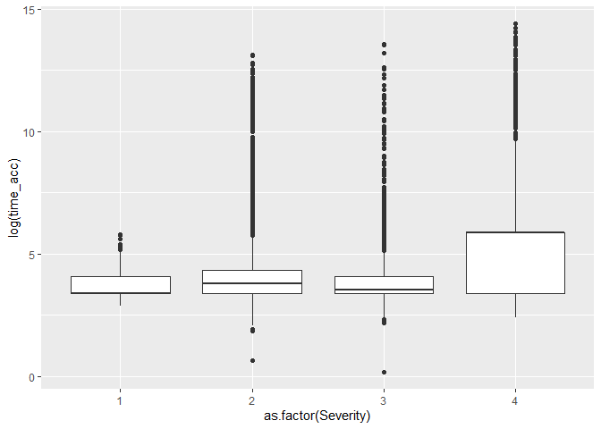

US\_accidents
================
Mburu
3/12/2020

## 

``` r
library(tidyverse)
library(plotly)
library(lubridate)
library(data.table)
library(zoo)
library(knitr)
library(sf)
library(sp)
```

# 

``` r
us_accidents <- fread("US_Accidents_Dec19.csv")

head(us_accidents) %>%
    kable()
```

| ID  | Source   | TMC | Severity | Start\_Time         | End\_Time           | Start\_Lat | Start\_Lng | End\_Lat | End\_Lng | Distance(mi) | Description                                                                           | Number | Street                    | Side | City         | County     | State | Zipcode    | Country | Timezone   | Airport\_Code | Weather\_Timestamp  | Temperature(F) | Wind\_Chill(F) | Humidity(%) | Pressure(in) | Visibility(mi) | Wind\_Direction | Wind\_Speed(mph) | Precipitation(in) | Weather\_Condition | Amenity | Bump  | Crossing | Give\_Way | Junction | No\_Exit | Railway | Roundabout | Station | Stop  | Traffic\_Calming | Traffic\_Signal | Turning\_Loop | Sunrise\_Sunset | Civil\_Twilight | Nautical\_Twilight | Astronomical\_Twilight |
| :-- | :------- | --: | -------: | :------------------ | :------------------ | ---------: | ---------: | -------: | -------: | -----------: | :------------------------------------------------------------------------------------ | -----: | :------------------------ | :--- | :----------- | :--------- | :---- | :--------- | :------ | :--------- | :------------ | :------------------ | -------------: | -------------: | ----------: | -----------: | -------------: | :-------------- | ---------------: | ----------------: | :----------------- | :------ | :---- | :------- | :-------- | :------- | :------- | :------ | :--------- | :------ | :---- | :--------------- | :-------------- | :------------ | :-------------- | :-------------- | :----------------- | :--------------------- |
| A-1 | MapQuest | 201 |        3 | 2016-02-08 05:46:00 | 2016-02-08 11:00:00 |   39.86515 | \-84.05872 |       NA |       NA |         0.01 | Right lane blocked due to accident on I-70 Eastbound at Exit 41 OH-235 State Route 4. |     NA | I-70 E                    | R    | Dayton       | Montgomery | OH    | 45424      | US      | US/Eastern | KFFO          | 2016-02-08 05:58:00 |           36.9 |             NA |          91 |        29.68 |             10 | Calm            |               NA |              0.02 | Light Rain         | FALSE   | FALSE | FALSE    | FALSE     | FALSE    | FALSE    | FALSE   | FALSE      | FALSE   | FALSE | FALSE            | FALSE           | FALSE         | Night           | Night           | Night              | Night                  |
| A-2 | MapQuest | 201 |        2 | 2016-02-08 06:07:59 | 2016-02-08 06:37:59 |   39.92806 | \-82.83118 |       NA |       NA |         0.01 | Accident on Brice Rd at Tussing Rd. Expect delays.                                    |   2584 | Brice Rd                  | L    | Reynoldsburg | Franklin   | OH    | 43068-3402 | US      | US/Eastern | KCMH          | 2016-02-08 05:51:00 |           37.9 |             NA |         100 |        29.65 |             10 | Calm            |               NA |              0.00 | Light Rain         | FALSE   | FALSE | FALSE    | FALSE     | FALSE    | FALSE    | FALSE   | FALSE      | FALSE   | FALSE | FALSE            | FALSE           | FALSE         | Night           | Night           | Night              | Day                    |
| A-3 | MapQuest | 201 |        2 | 2016-02-08 06:49:27 | 2016-02-08 07:19:27 |   39.06315 | \-84.03261 |       NA |       NA |         0.01 | Accident on OH-32 State Route 32 Westbound at Dela Palma Rd. Expect delays.           |     NA | State Route 32            | R    | Williamsburg | Clermont   | OH    | 45176      | US      | US/Eastern | KI69          | 2016-02-08 06:56:00 |           36.0 |           33.3 |         100 |        29.67 |             10 | SW              |              3.5 |                NA | Overcast           | FALSE   | FALSE | FALSE    | FALSE     | FALSE    | FALSE    | FALSE   | FALSE      | FALSE   | FALSE | FALSE            | TRUE            | FALSE         | Night           | Night           | Day                | Day                    |
| A-4 | MapQuest | 201 |        3 | 2016-02-08 07:23:34 | 2016-02-08 07:53:34 |   39.74775 | \-84.20558 |       NA |       NA |         0.01 | Accident on I-75 Southbound at Exits 52 52B US-35. Expect delays.                     |     NA | I-75 S                    | R    | Dayton       | Montgomery | OH    | 45417      | US      | US/Eastern | KDAY          | 2016-02-08 07:38:00 |           35.1 |           31.0 |          96 |        29.64 |              9 | SW              |              4.6 |                NA | Mostly Cloudy      | FALSE   | FALSE | FALSE    | FALSE     | FALSE    | FALSE    | FALSE   | FALSE      | FALSE   | FALSE | FALSE            | FALSE           | FALSE         | Night           | Day             | Day                | Day                    |
| A-5 | MapQuest | 201 |        2 | 2016-02-08 07:39:07 | 2016-02-08 08:09:07 |   39.62778 | \-84.18835 |       NA |       NA |         0.01 | Accident on McEwen Rd at OH-725 Miamisburg Centerville Rd. Expect delays.             |     NA | Miamisburg Centerville Rd | R    | Dayton       | Montgomery | OH    | 45459      | US      | US/Eastern | KMGY          | 2016-02-08 07:53:00 |           36.0 |           33.3 |          89 |        29.65 |              6 | SW              |              3.5 |                NA | Mostly Cloudy      | FALSE   | FALSE | FALSE    | FALSE     | FALSE    | FALSE    | FALSE   | FALSE      | FALSE   | FALSE | FALSE            | TRUE            | FALSE         | Day             | Day             | Day                | Day                    |
| A-6 | MapQuest | 201 |        3 | 2016-02-08 07:44:26 | 2016-02-08 08:14:26 |   40.10059 | \-82.92519 |       NA |       NA |         0.01 | Accident on I-270 Outerbelt Northbound near Exit 29 OH-3 State St. Expect delays.     |     NA | Westerville Rd            | R    | Westerville  | Franklin   | OH    | 43081      | US      | US/Eastern | KCMH          | 2016-02-08 07:51:00 |           37.9 |           35.5 |          97 |        29.63 |              7 | SSW             |              3.5 |              0.03 | Light Rain         | FALSE   | FALSE | FALSE    | FALSE     | FALSE    | FALSE    | FALSE   | FALSE      | FALSE   | FALSE | FALSE            | FALSE           | FALSE         | Day             | Day             | Day                | Day                    |

``` r
setnames(us_accidents, "State", "abbr") # to work with maps data

sum_dat <- us_accidents[, .(freq = .N), by = abbr] %>%
    .[order(freq, decreasing = T)]
```

``` r
us_df <- usmap::us_map()


us_sum_acc <- merge(sum_dat, us_df, by ="abbr" )


ggplot(us_sum_acc, aes(x, y, group = group, 
                                fill = freq, text = full))+
    geom_polygon()+
    theme_void()+
    scale_fill_viridis_c()
```

<!-- -->

``` r
time_cols <- c("Start_Time", "End_Time")

us_accidents[, (time_cols) := lapply(.SD, ymd_hms), .SDcols = time_cols]

#extract date
us_accidents[, Start_Date := as.Date(Start_Time)]

## tred in numbers

#on average how many deaths occur per day
daily_dat <- us_accidents[, .(freq = .N),
                          by = .(abbr,Start_Date)] %>%
    .[, .(daily_average = mean(freq)), by = abbr]


us_daily_acc <- merge(daily_dat, us_df, by ="abbr" )
```

``` r
ggplot(us_daily_acc, aes(x, y, group = group, 
                                fill = daily_average))+
             geom_polygon()+
             scale_fill_viridis_c()+
             theme_void()
```

<!-- -->

``` r
ca_counties <- st_read("CA_Counties")
```

    ## Reading layer `CA_Counties_TIGER2016' from data source `C:\Users\mmburu\Desktop\R\machine_learning\us_accidents\CA_Counties' using driver `ESRI Shapefile'
    ## Simple feature collection with 58 features and 17 fields
    ## geometry type:  MULTIPOLYGON
    ## dimension:      XY
    ## bbox:           xmin: -13857270 ymin: 3832931 xmax: -12705030 ymax: 5162404
    ## epsg (SRID):    3857
    ## proj4string:    +proj=merc +a=6378137 +b=6378137 +lat_ts=0.0 +lon_0=0.0 +x_0=0.0 +y_0=0 +k=1.0 +units=m +nadgrids=@null +wktext +no_defs

``` r
ca_counties  <- st_transform(ca_counties , crs = "+proj=longlat")
```

``` r
ca_acc <- us_accidents[abbr == "CA"]

ggplot(ca_counties)+
    geom_sf()+
    geom_point(data = ca_acc,
               aes(Start_Lng,Start_Lat), 
               color = "blue", alpha = 0.9) +
    theme_void()
```

<!-- -->

``` r
ca_counties_sp <- as(ca_counties, Class = "Spatial")

library(spatialEco)

proj4string = CRS("+proj=longlat")
ca_acc_shp <- SpatialPointsDataFrame(ca_acc[,.(Start_Lng,Start_Lat)], 
                                      ca_acc ,    
                                      proj4string = proj4string)  
```

``` r
pts.poly <- point.in.poly(ca_acc_shp, ca_counties_sp)

ca_acc_comb <- st_as_sf(pts.poly) %>% setDT()

ca_acc_comb[, geometry := NULL]
```

``` r
df_sum <- ca_acc_comb[, .(freq = .N), by = .(NAME, Start_Date)] %>%
    .[, .(mean_daily = mean(freq), median_daily = median(freq)), by = NAME] %>%
    merge(ca_counties, by = "NAME")

df_sum <- st_set_geometry(df_sum, "geometry")
```

``` r
library(tmap)


tm_shape(df_sum)+
    tm_polygons(col= "mean_daily", palette = "BuPu")+
    tm_borders(col = "black")
```

<!-- -->

``` r
tm_shape(df_sum)+
    tm_polygons(col= "median_daily", palette = "BuPu")+
    tm_borders(col = "black")
```

<!-- -->

``` r
severity_cases <- us_accidents[, .(number_cases = .N), by = .(abbr, Severity )] %>%
    dcast(abbr~Severity, value.var = "number_cases", fun.aggregate = sum)

setorder(severity_cases, -3, -4)

kable(severity_cases)
```

| abbr |   1 |      2 |      3 |    4 |
| :--- | --: | -----: | -----: | ---: |
| CA   | 246 | 445381 | 211189 | 6388 |
| TX   | 120 | 215027 |  79467 | 3448 |
| FL   |  71 | 144622 |  71631 | 7422 |
| NY   |  22 |  82388 |  49968 | 5421 |
| GA   |  27 |  34605 |  42393 | 6595 |
| VA   |  28 |  42556 |  32750 | 4623 |
| SC   |  40 | 114339 |  31366 |  944 |
| MI   |  29 |  52583 |  31361 | 4721 |
| MN   |   9 |  37017 |  25348 |  353 |
| IL   |  15 |  58901 |  24706 | 2768 |
| WA   |  30 |  37528 |  21129 | 2680 |
| NC   |  30 | 121261 |  18837 | 2332 |
| MD   |  33 |  20285 |  18341 | 4669 |
| TN   |  20 |  38526 |  18275 | 1468 |
| PA   |  37 |  67778 |  17862 | 4718 |
| OH   |  16 |  33817 |  17057 | 4973 |
| CO   |   5 |  21235 |  15699 | 3185 |
| MO   |   7 |  12476 |  15090 | 1439 |
| NJ   |  21 |  33264 |  13904 | 2753 |
| MA   |  15 |  19907 |  12839 |  253 |
| AZ   |  21 |  47248 |  12003 | 3058 |
| AL   |  18 |  23906 |  11931 |  514 |
| CT   |  17 |  10650 |  10455 | 1681 |
| UT   |   3 |  29890 |  10301 | 1191 |
| LA   |  19 |  41674 |   9887 |  901 |
| KY   |   7 |   9428 |   8927 |  760 |
| IN   |  17 |  18705 |   8826 | 2492 |
| OR   |   2 |  61538 |   6921 | 2379 |
| WI   |   1 |   8937 |   6182 | 2460 |
| RI   |   0 |   4963 |   5418 |  102 |
| IA   |   3 |   4678 |   4828 |  837 |
| OK   |  15 |  46194 |   4677 |  411 |
| NE   |  12 |  18868 |   3370 |  255 |
| KS   |   0 |   3262 |   3246 |  379 |
| NV   |   1 |   6050 |   3043 |  430 |
| MS   |   1 |   3317 |   2373 |  270 |
| NM   |   1 |   2775 |   1917 |  327 |
| NH   |   2 |   5664 |   1232 |  166 |
| DC   |   1 |   2382 |    867 |  403 |
| WV   |   1 |   1352 |    467 |  454 |
| AR   |   0 |    860 |    439 |  450 |
| DE   |   3 |   3457 |    400 |  574 |
| ID   |   0 |   1373 |    189 |  195 |
| WY   |   0 |    129 |    176 |  187 |
| MT   |   0 |    263 |    135 |  106 |
| VT   |   1 |    414 |    111 |   59 |
| ME   |   1 |   1899 |     68 |   97 |
| ND   |   0 |     21 |     11 |   11 |
| SD   |   0 |     17 |      8 |   35 |

``` r
#convert to minutes
us_accidents[, time_acc := (as.numeric(End_Time - Start_Time))/60]

#check if severity is associated with time
p <- ggplot(us_accidents) +
    #geom_bar() +
    geom_boxplot(aes(as.factor(Severity), log(time_acc)))

p
```

<!-- -->

``` r
us_accidents[, .(mean_dur = mean(time_acc, na.rm = T),
                meadian_dur =  median(time_acc, na.rm = T),
                first_quartile = quantile(time_acc, 0.25, na.rm = T),
                third_quartile = quantile(time_acc, 0.75, na.rm = T)),
             by = Severity] %>%
    kable()
```

| Severity | mean\_dur | meadian\_dur | first\_quartile | third\_quartile |
| -------: | --------: | -----------: | --------------: | --------------: |
|        3 |  79.29419 |     34.40000 |        29.60000 |        59.43333 |
|        2 | 102.96922 |     44.71667 |        29.76667 |        76.56667 |
|        1 |  45.25671 |     30.00000 |        30.00000 |        59.70000 |
|        4 | 912.54198 |    360.00000 |        29.60000 |       360.00000 |
